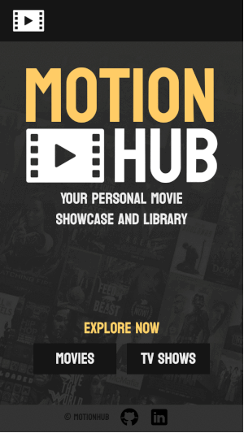
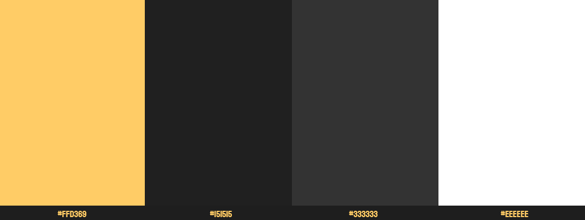
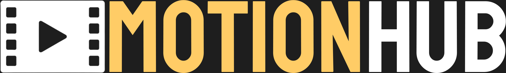
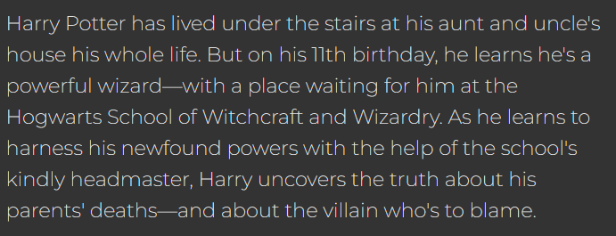

# MotionHub - Your Personal Movie Showcase and Library

[MotionHub](https://motionhub.vercel.app/home) is a user-friendly website that provides a seamless and enjoyable experience for browsing movies and TV shows. With the ability to filter by popularity, upcoming releases, and top-rated content, along with genre-based browsing, MotionHub empowers you to discover and organize your personal movie and TV show library effortlessly.

## Table of Contents

- [1. Features](#1-features)
- [2. Technology Stack](#2-technology-stack)
- [3. Design and Prototypes](#3-design-and-prototypes)
- [4. Planned Features](#4-planned-features)
- [5. Developers](#5-developers)

## 1. Features

### Movie Showcase

- Filter movies by popular, upcoming, and top-rated.
- Browse movies by genres.
- Click on a movie poster to view detailed information, including title, genre, release year, overview, rating, duration, and main actors.

### TV Show Library

- Filter TV shows by popularity, currently on the air, and top-rated.
- Browse TV shows by genre.
- Click on a TV show poster to view comprehensive details, including the number of seasons, episodes, last episode, overview, rating, and main actors.

### Search Functionality

- Search for movies and TV shows by name using the search bar.

### Infinite Scrolling

- Enjoy an infinite scrolling feature for a seamless browsing experience.

## 2. Technology Stack

MotionHub was developed as part of a coursework project and utilizes the following technologies:

### Angular

Angular was the core framework used to structure and build the frontend of MotionHub. It facilitated the creation of components, services, and modules that formed the user interface. Angular's routing system was used to manage navigation between different parts of the application, enabling seamless transitions and user interactions.

### TypeScript

TypeScript was the primary programming language used to write the frontend code. It added strong typing to the application, catching errors during development and providing better code quality and maintainability. It was instrumental in defining the data models, logic, and interactions within MotionHub.

### Tailwind CSS

Tailwind CSS was employed to style the user interface of MotionHub. It allowed for the quick and consistent styling of components and layouts through utility classes. This approach streamlined the design process and ensured a responsive and visually appealing user interface without the need for extensive custom CSS.

## 3. Design and Prototypes

### Color palette

MotionHub's design is characterized by a thoughtfully chosen color palette that enhances the user experience and gives the website a modern and visually appealing look. The primary colors used are:

### Fonts

MotionHub uses a pair of carefully selected fonts to achieve a balance of style and readability:

**Koulen (cursive):** The 'Koulen' font is used for creative and decorative elements.

**Montserrat (sans-serif):** The 'Montserrat' font is the primary font for text and content.

The combination of the color palette and fonts in MotionHub aims to provide a visually appealing, user-friendly, and modern design. The yellow highlight color adds energy and draws attention to key elements, while the white and gray colors maintain readability and simplicity. The choice of fonts balances style with clarity, ensuring that the website is both attractive and functional.

### Figma Prototypes

High fidelity prototypes were design to anticipate user experience. Both versions, desktop and mobile, receibe feedback from potential users and were then improved accordingly. These are the final prototypes:

[Figma Interactive Desktop Prototype](https://www.figma.com/proto/fcHlx6qrscIuYm2MBVfVBQ/MotionHub?type=design&node-id=1-2&t=eWHCycCsSgEA9krl-1&scaling=scale-down&page-id=0%3A1&starting-point-node-id=1%3A2&mode=design)

[Figma Interactive Mobile Prototype](https://www.figma.com/proto/fcHlx6qrscIuYm2MBVfVBQ/MotionHub?type=design&node-id=67-14&t=kds4AD4fBjkaJY8z-1&scaling=scale-down&page-id=67%3A13&starting-point-node-id=67%3A14&mode=design)

## 4. Planned Features

We're committed to continually enhancing your MotionHub experience. In future versions, we have some exciting features and improvements on the horizon:

### User Accounts and Personalization

- **User Profiles:** Create your own user account to unlock a personalized experience.

- **Favorite Movies** and TV Shows: Save your favorite movies and TV shows to access them easily.

- **Watchlists:** Build and manage watchlists to keep track of content you want to watch later.

- **Recommendations:** Get personalized recommendations based on your viewing history.

## 5. Developers

MotionHub was a project developed with passion and dedication by me, Andressa Rodrigues, during my time at Laboratoria. This project has been a valuable part of my learning journey, allowing me to apply and expand my skills in web development. I'm thrilled to share MotionHub with you, and I hope it enhances your movie and TV show browsing experience.
